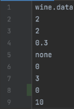
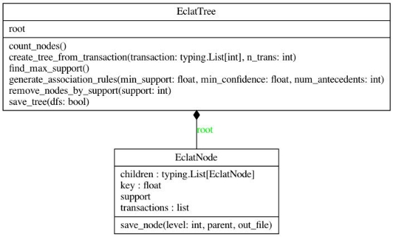
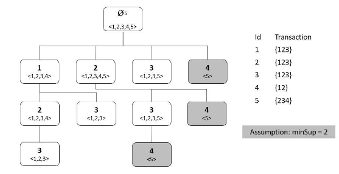

WARSAW UNIVERSITY OF TECHNOLOGY

2021 - 2022

SUBJECT EDAMI

ECLAT

Association rules with items occurrence constraints

Project realized by                  *Alessandro Cavallotti, Catarina Gatinho*

DESCRIPTION OF THE TASK

The project task is to code a simple version of the Equivalence Class Clustering Lattice Traversal (ECLAT) algorithm in order to discover frequent itemsets. After the exploring of the item sets the program should be able to generate association rules, using the discovered itemset, with constraints regarding the occurrence of items in the association rules. The considered constraints that the user can choose from are the following:

1. Generation of association rules that **contain some items** from a given item setc\_1.
1. Generation of association rules that **contain all the items** from a given item setc\_2.
1. Generation of association rules that **do not contain any item** from a given item setc\_3.

For all the three constraints the program will look in both parts of the rule, the antecedent and the consequent. The program will also be able to give statistics information about the rules such as support and confidence and those parameters can be set by the user as threshold values to allow filtering in the output rules.

DESCRIPTION OF THE FORM OF INPUT AND OUTPUT DATA

The I/O data streams processed by the program are text files. The only constraint for the program to run with different datasets are the following:

- One transaction per line.
- Each item in the transaction must be an integer or a decimal number.
- The item in the transaction must be separated by an empty space.

The order or the number in the transaction does not have to be in a specific order.

For this project we choose to use 3 different datasets to test all the functionality of our program. Other than the dataset the program also allows the user to set some parameters that act like filters. All the arguments for the program are specified in the file named *data.conf* and it has the following structure:

Line 1: Name of the dataset file (string).

Line 2: Minimum support threshold for each node (integer number).

Line 3: Minimum support threshold for each association rule (integer number).

Line 4: Minimum confidence threshold for each association rule (float number).

Line 5: Type of constraint to apply to the generated rules (“some” for c\_1, “all” for c\_2, “none” for c\_3, “” for no constraint). Line 6: List of the item IDs that have to match the chosen constraint in the preview line (list of integers).

Line 7: Number of antecedents for each association rule (integer number).

Line 8: Boolean value is discretization is enable (0 for No discretization, any other number to enable the discretization) Line 9: Number of classes which discretize each attribute in the dataset (integer number).

Is already available a version of the *data.conf* file here reported:

The program can run in each Operating System that has installed a version of Python >= 3. After entering the project folder, the command to execute the program is *python3 main.py*.

The program will output the result both on the terminal and on files. On the terminal you will see:

- Dataset [dataset chosen]
- Support of nodes [set value]
- Support of rules [set value]
- Min confidence [set value]
- Type of filter [set value]
- Filter list [set value]
- Number of antecedents in association rules [set value]
- Is discretization performed? [set value]
- Number of transaction [length of the dataset]
- Average number of items in transactions [computed value] # This is useful when it comes to compute the theoretical number of nodes generated in the tree.
- Building the tree...
- [datetime of execution started] Execution started.
- Generation of the tree completed
- [datetime of execution completed] Execution completed.
- Number of nodes in the ECALT tree [number of nodes]
- Max support in nodes [max support found]
- Removing the nodes with support < [set value]
- Number of nodes in the ECALT tree [number of nodes after pruning]
- [datetime of execution started] Generating association rules with support >= [set value] confidence >= [set value]
- [date time of execution ended] Generation of the rules completed
- Total number of rules [number of generated rules]
- Saving rules with [set value of filtering] elements in [set value of list of items to filter]
- Number of matched rules [number of rules matched]
- Check the file rules.txt

For every execution of the program 2 files are going to be generated. The first file *nodes.txt* contains all the information about the nodes generated in the ECAL already filtered by the minimum support threshold chosen by the user.

The file has the following structure:

- Each line is a link between two nodes.
- Each line has the following structure:

  *# level parent\_node → child\_node, support of the node, [list of transaction in which the node is present]*

  The levels are expressed by L[number of the level] and the root node instead of having the value 0 is replaced with the string *root.*

The other generated file is *rules.txt* and contains information about the generated rules already filtered by support, confidence and the custom constraint set by the user.

The file has the following structure:

- Each line is an association rule that follows all the constraints.
- Each line has the following structure

  *#rule\_number list of antecedent => list of consequences [support\_value, confidence\_value]*

For every execution the files will be overwritten so be sure to save a copy of those files if there is a need of saving the result.

DESCRIPTION OF ALL IMPORTANT DESIGN (E.G. CLASS DIAGRAM(S)) AND IMPLEMENTATION ISSUES

For the creation of the ECLAT algorithm we decided to implement a tree structure with multiple siblings. We code two classes that are connected as shown in the diagram:

- **EclatNode** which is responsible for keeping the data about the node in the ECALT tree and is represented by:
  - the node value is stored in the attribute *key*
  - the list of children is stored in the attribute *children*
  - the list of the transactions number in which the item occurs is stored in the attribute *transactions*
  - the support of the node that is computed as the length of the list of transactions and is given by the property *support*
- **EclatTree** which contains the root node of type EclatNode and implements all the methods to build the tree, generate the association rules from the nodes and output the generated information.

The first function to implement for building the tree is the node insertion method named *create\_tree\_from\_transaction*. This method takes as arguments a list that represents a new transaction to insert in the tree and the transaction’s number and its objective is to insert a new node if the node didn’t exist before in the tree or to extend the list of transactions in which the node is present otherwise. The insertion of a new node is made in the way of keeping the numerical order of the node’s keys. So given the following set of transactions, the program will generate this tree.

This class is also in charge of generating the association rules from nodes, this task is taken care of by the method *generate\_association\_rules*. For each child of the root node in the tree the program calls the private method *\_generate\_rules\_from\_parent* passing the number of antecedents required for each association. This method generates the rules with the exact number of antecedents specified and as consequent the nodes in the subtree generated by the last antecedent. The advantage of building the rules after constructing the tree is that the support of the rule is already stored in the deepest node of the considered subtree, so it is enough to save that value when building the rule. The rule are stored in a dictionary that has the following fields:

- antecedent → list of item IDs (build using the recursive function *\_generate\_rules\_from\_parent*)
- consequent → list of item IDs (build using the recursive function *\_generate\_rules\_from\_parent*)
- support → support value of the rule that is equal to the deepest node in the considered subtree
- confidence → confidence value of the rule computed as *rule\_support (support of the last element in the consequents)* / *support of the antecedent (support of the last element in the list of the antecedent)*

The ECALT algorithm also allows the pruning of all the nodes with a lower support then the threshold value. This function is implemented in the method *remove\_nodes\_by\_support*, it is recursive and each time reset the list of children of the current parent node with only the children that has a support greater or equal to the minimum support threshold, at it repeat the same process for each children in the parent node.

The most difficult part was the generation of the association rules. This task was tricky because we first started by setting as antecedent only the first root’s child and as the consequent all the other nodes in the subtree generated by the root’s child. Later on we decided to increase the difficulties and we tried to let the user choose the number of antecedents so we added a new argument to the *\_generate\_rules\_from\_parent* function with the number of antecedents required. Then for each recursive call of the function we decrease this parameter and if the number is >= 1 the node considered in the iteration goes into the antecedent otherwise it will be considered as a consequent.

Another issue we faced was the huge number of nodes generated by the algorithm and that is time and memory consuming. We had to choose a small dataset in order to see all the execution of the code in a reasonable amount of time. We faced this problem only with the retails dataset that we decided to reduce by ⅓.

The number of nodes are in the order of O() where *k* indicates the number of transactions and *h* represents the height of the tree, but this value is not stable with a dataset that contains transactions of different length because the difference in the number of generated nodes is not linear, so it is hard to predict.

PRESENTATION OF THE PERFORMED EXPERIMENTS INCLUDING A DESCRIPTION OF INPUT DATA

The experiments performed were done using 3 different datasets all with the same format that includes numerical values for items (can be integer or decimal) and one space between each item in the transaction. The dataset we used to perform the computations are:

- **Retails**

  The dataset represents a list of purchases done by customers in different periods. The length of each transaction is different and that makes the computation of the theoretical number of nodes harder. It also makes the algorithm slower due to the computation of long transactions. This was one of the reasons we chose to take a smaller chunk of the dataset (3000 transactions out of 88162) because after some trials we saw that the computation time and the memory usage were not reasonable for this task. With this amount of data the program takes about 2 minutes to complete. Each item in the transactions is represented by its integer ID.

  In this case we are trying to find the best rules that describe which products are bought after buying a specific product. This filter can be applied using the constraint “all” and putting in the list of elements the item of interest. The result of these rules could be used for the placement of the products next to the most frequent item bought with the considered item as an influence on the customer choice.

- **Wine**

  These data are the results of a chemical analysis of wines grown in the same region in Italy but derived from three different cultivars. Each transaction starts with the class number assigned to a specific wine and all the other 13 parameters are values determined after the wine analysis. The computed attributes are:

1. Alcohol
2. Malic acid
2. Ash
2. Alkalinity of ash
2. Magnesium
2. Total phenols
2. Flavonoids
2. Non Flavonoid phenols
2. Proanthocyanidins
2. Color intensity
2. Hue
2. OD280/OD315 of diluted wines
2. Proline

In a classification context, this is a well posed problem with "well behaved" class structures. A good data set for first testing of a new classifier, but not very challenging.

The generated rules show what is the most common wine composition for each type of cultivar as the first value in the transaction is the class number for the specific wine and could be used as the only item in the antecedent part. The attributes could also be descreditized to try to have better results due to the fact that the values of the attributes are very spread. The use for the generated rules could be used for classification purposes in the sense of associating to a new sample of wine its most likely cultivar of origin.

- **Liver Disorders**

  Each transaction in the dataset has 7 parameters and here are all well described:

1. mcv mean corpuscular volume [max = 103.0 min = 65.0]
1. alk phos alkaline phosphatase [max = 138.0 min = 23.0]
1. sgpt alanine aminotransferase [max = 155.0 min = 4.0]
1. sgot aspartate aminotransferase [max = 82.0 min = 5.0]
1. gammagt gamma-glutamyl transpeptidase [max = 297.0 min = 5.0]
1. drinks number of half-pint equivalents of alcoholic beverages drunk per day [max = 20.0 min = 0.0]

The first 5 variables are all from blood tests which are thought to be sensitive to liver disorders that might arise from excessive alcohol consumption. Each line in the dataset constitutes the record of a single male individual. The dataset does not contain any variable representing presence or absence of a liver disorder and the total number of transactions is equal to 345. In this case we tried to apply the discretization to the dataset because of the huge variety of the value for each attribute. Due to the big ranges of the attribute values we tried to discretize each range in 100 subranges and assign to the attribute value the closest number in the generated subrange. In this way we aggregate similar values to the same value but the generated rule didn’t mean much so we disabled the discretization for this dataset. The generated rules had 5 antecedents for the first 5 values from the blood test and the last value representing the drinks number of half-pint equivalents of alcoholic beverages drunk per day. We set the minimum support threshold for both nodes and rules equal to 2 and as minimum confidence parameter equal to 0.2. The rules we obtained are the following ones:

- #n° ant. => consequents [support, confidence]
- #1 91.0, 63.0, 25.0, 26.0, 15.0 => 6.0 [2, 1.0]
- #2 92.0, 80.0, 10.0, 26.0, 20.0 => 6.0 [2, 1.0]
- #3 94.0, 58.0, 21.0, 18.0, 26.0 => 2.0 [2, 1.0]
- #4 97.0, 71.0, 29.0, 22.0, 52.0 => 8.0 [2, 1.0]

OBTAINED RESULTS - CONCLUSIONS

Our implementation of the ECLAT algorithm works perfectly with the dataset that follows the format specified before and is able to generate any tree with ascending numeric sorting of nodes. Our structure is also able to extract information from the tree such as what is the maximum support in the nodes, the number of nodes and is able to prune nodes that fall under the threshold support value. One of the most important things is that it is able to generate association rules of any given length for the antecedent and any given threshold support and confidence. The performance tests were done for each dataset with 0 as minimum threshold value for support of nodes and rules and as confidence as well. No filtering is applied for the generated rules. The only specific constraint is the number of antecedents that is set to 1.

|**Dataset**|**Number of transactions**|**Average number of element in the transaction**|**Height of the tree**|
**Upper bound on the number of nodes**

|**Time spent for build the tree**|**Number of generated nodes**|**Max support in nodes**|**Time spent for build the association rules**|**Number of generated rules**|
| - | :- | :- | :- | :- | :- | :- | :- | :- | :- |
|**Retails**|3000|10,12|51|251|1 min 24 sec|1\.867.004|1\.707|10 sec|189\.665|
|**Liver diseases**|345|6|6|55\.987|93 ms|9\.726|108|24 ms|2\.890|
|**Wine**|178|14|14|1,216|939 ms|79\.806|81|363 ms|14\.541|

The result reports that the number of nodes grows exponentially with the average number of elements in the transaction. This is visible when comparing the dataset Wine with the Liver diseases where even if the number of transactions is almost double, the number of the generated nodes is much different because of the much higher average number of elements in the transaction. It also matters how spread the attributes values are. For this test we can assume that they all share a similar amount of randomness in the attributes value.

The number of rules instead is well below the number of nodes. That's also because only the rule with 1 antecedent was taken and not all of them that would be a good feature for further implementation. The ECLAT required a lot of memory space especially in the case of big dataset like the Retails but the result in terms of time consumptions are better. The most time consuming process is the generation of the nodes that stays under 2 minutes in the worst case and under 1 second for the Wine and Liver diseases dataset. The generation of the rules instead is quite fast and takes only 10 seconds in the worst case and less than 0,5 seconds in the other cases.

To run the experiment it is just necessary to set the parameters in the data.conf file and run the command *python3 main.py* from inside the project folder. All the details of the executions will be printed in the standard output and the result of the executions will be available in the files *rules.txt* and *nodes.txt*. All the data reported can be replicated using the dataset already provided in the folder. The script will also work with other dataset that follows the format described above in this document.
6
